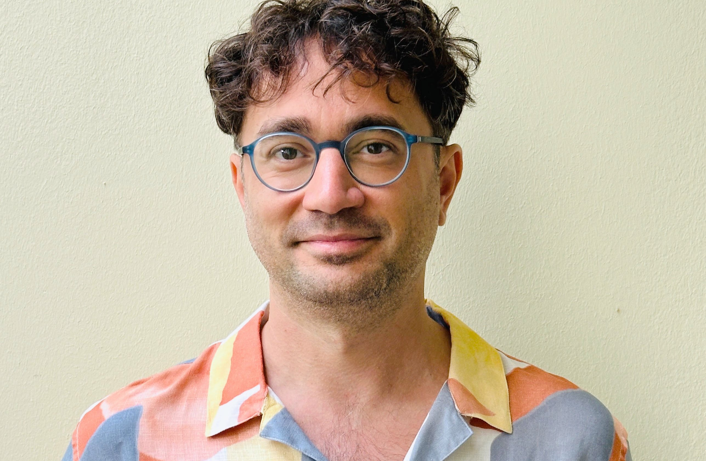

# Who are we?

## Your instructors

::::{.columns}
::: {.column width="50%"}

:::
::: {.column width="50%"}

:::
::::

## Levent Neyse {.smaller}

::::{.columns}
::: {.column width="50%"}

Behavioral economist studying how people make economic and social decisions, as well as meta-scientific topics such as replicability and research transparency. 

 [SOEP Innovation Sample](https://www.diw.de/en/diw_01.c.601784.en/soep-is_innovative_modules.html) at [DIW Berlin](https://www.diw.de/en),  co-PI of the [Lab$^2$ metascience lab](https://www.labsquare.net/).

:::
::: {.column width="50%"}

:::

::::

## Lars Vilhuber {.smaller}

::::{.columns}
::: {.column width="50%"}

Executive Director of the [Labor Dynamics Institute](http://www.ilr.cornell.edu/ldi) and Senior Research Associate in the [Economics Department](http://economics.cornell.edu/) at [Cornell University](http://www.cornell.edu/), and the [American Economic Association](https://www.aeaweb.org/)’s Data Editor.

:::

::: {.column width="50%"}

:::

::::

## Data Editor of the AEA

::::{.columns}
::: {.column width="50%"}

2500 Manuscripts and 4800 Reports, approx. 4500 authors reached.

:::
::: {.column width="50%"}

:::
::::
