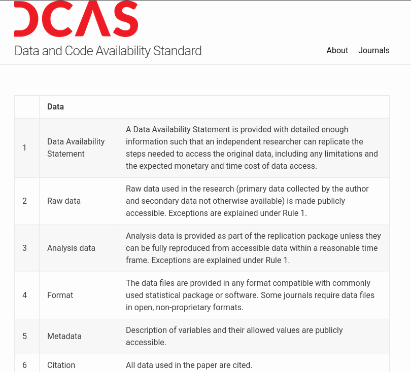
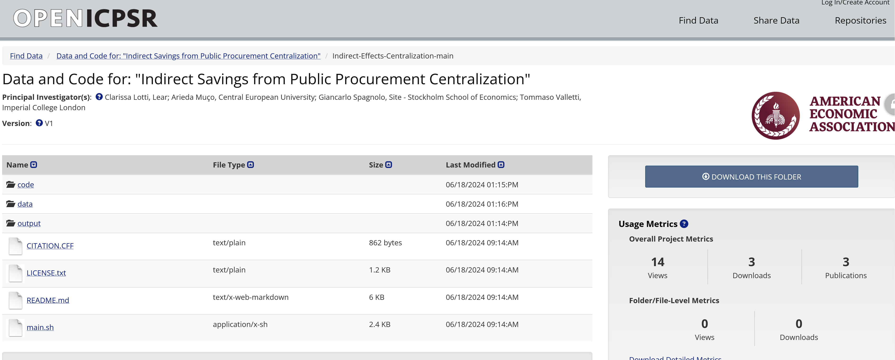

# What is... {background-image="images/lake-autumn.jpg" background-size="contain" background-position="bottom"}

## What is a replication package?

## A Replication Package is

- Code
- Data
- Materials (for surveys, experiments, ...)
- Instructions on how to obtain data not included
- Instructions on how to combine it all
- Known issues documented

## Complies with...

- [AEA Data and Code Availability policy](https://www.aeaweb.org/journals/data/data-code-policy)
- [Data and Code Availability Standard](https://datacodestandard.org/)  [.](index.html#/reproducibility-in-economics-and-beyond)

:::: {.columns}
:::{.column width="50%"}

:::
:::{.column width="50%"}

:::
::::

## Is stored in...

:::: {.columns}
:::{.column width="50%"}

- [AEA Data and Code Repository](https://www.openicpsr.org/openicpsr/search/aea/studies)
- Other trusted repositories

:::
:::{.column width="50%"}

:::
::::

